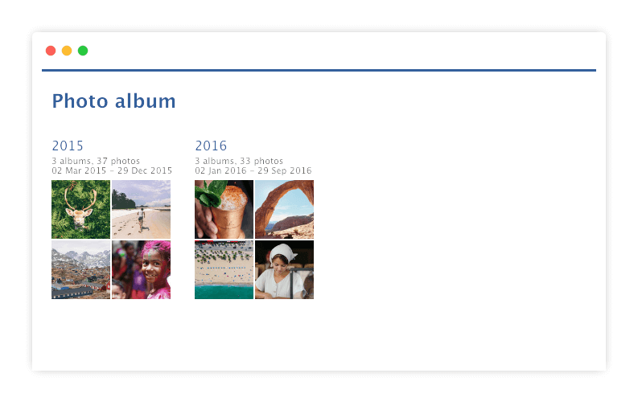

# @thumbsup/theme-classic

[](https://www.npmjs.com/package/@thumbsup/theme-classic)
[](https://travis-ci.org/thumbsup/theme-classic)

One of the built-in themes for https://github.com/thumbsup/thumbsup.

---

## Usage

```bash
thumbsup --theme classic
```

## Screenshots




## Developing

Testing the theme

```bash
thumbsup --input /photos --output ./tmp --theme-path ./theme
```

Publishing the theme:

```bash
npm publish
```
